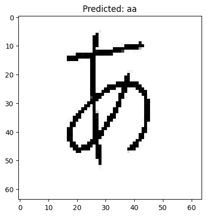

# Proyecto-DeepLearning

# Predicción utilizando el modelo MNIST aplicado hacia el alfabeto japónes




Esta aplicación de Streamlit permite dibujar caracteres hiragana en un canvas y obtener predicciones en tiempo real usando diferentes modelos.

## Características

- **Canvas de dibujo interactivo**: Dibuja caracteres hiragana con el ratón
- **Predicciones en tiempo real**: El modelo identifica el carácter dibujado
- **Top 10 predicciones**: Muestra las 10 predicciones más probables con sus porcentajes
- **Visualización de probabilidades**: Gráfico de barras mostrando la distribución
- **Configuración ajustable**: Cambia el grosor del trazo y tamaño del canvas

## Requisitos

```bash
pip install streamlit streamlit-drawable-canvas tensorflow pillow numpy pandas
```

## Cómo ejecutar

Desde la carpeta `UI/`, ejecuta:

```bash
streamlit run app.py
```

Luego, en la barra lateral, selecciona la opción que desees de la lista de páginas.

## Uso

1. Dibuja un carácter hiragana en el canvas blanco usando el ratón
2. Haz clic en el botón **"🔮 Predecir"** para obtener las predicciones
3. Revisa las predicciones del modelo:
   - Predicción principal con su confianza
   - Tabla con las Top 10 predicciones
   - Gráfico de barras de probabilidades
4. Haz clic en **"🗑️ Limpiar Canvas"** para borrar y dibujar de nuevo

## Configuración

En la barra lateral puedes ajustar:
- **Grosor del trazo**: Entre 5 y 30 píxeles
- **Tamaño del canvas**: Entre 200 y 500 píxeles

## Caracteres soportados

El modelo puede reconocer los siguientes 46 caracteres hiragana:

あ (aa), ち (chi), え (ee), ふ (fu), は (ha), へ (he), ひ (hi), ほ (ho), い (ii),
か (ka), け (ke), き (ki), こ (ko), く (ku), ま (ma), め (me), み (mi), も (mo),
む (mu), な (na), ね (ne), に (ni), ん (nn), の (no), ぬ (nu), お (oo), ら (ra),
れ (re), り (ri), ろ (ro), る (ru), さ (sa), せ (se), し (shi), そ (so), す (su),
た (ta), て (te), つ (tsu), と (to), う (uu), わ (wa), を (wo), や (ya), よ (yo), ゆ (yu)

## Notas técnicas

- El modelo espera imágenes de 64x64 píxeles en escala de grises
- El canvas automáticamente redimensiona y procesa el dibujo
- El procesamiento de la foto es: fondo blanco, trazo negro

# Integrantes
- Ricardo Chuy, 221007
- Eunice Mata, 21231
- Jo